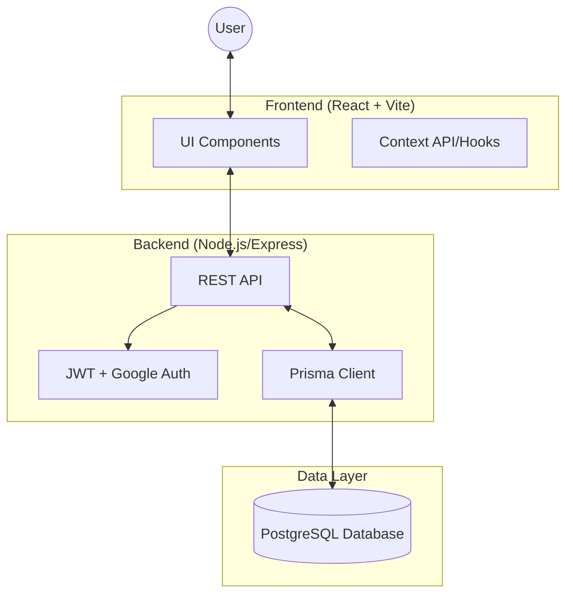

# Professional Invoice Generator (PIG)

## 📌 Overview
The Professional Invoice Generator (PIG) is a robust, full-stack web application designed for small businesses and freelancers to create, manage, and export professional-grade invoices. It features a dynamic real-time editor, secure user authentication (JWT & Google), and a centralized catalog for products (services) and customers to streamline the billing process.

## 🏗️ Architecture
The system follows a modern decoupled architecture:
- **Frontend**: A high-performance React SPA built with Vite 8 and React 19, featuring Tailwind CSS 4 for a premium, responsive UI.
- **Backend**: A Node.js and Express REST API handling business logic, authentication, and database orchestration.
- **Database**: PostgreSQL database, managed via Prisma 7 ORM for type-safe data access and migrations.
- **Infrastructure**: Fully containerized using Docker and Docker Compose for seamless development and deployment.

## 📊 Architecture Diagram


## 🔄 System Request Flow
1.  **Request Initiation**: Client sends an HTTP request with a JWT in the `Authorization` header.
2.  **Authentication**: `authMiddleware` verifies the token signature or validates the Google ID token.
3.  **Service Logic**: Controllers interact with the PostgreSQL database via Prisma singletons.
4.  **Data Processing**: Monetary calculations are handled with `Decimal` precision on the backend and formatted for the locale (₹) on the frontend.
5.  **Export (Frontend)**: Invoices are rendered as HTML and captured via `html2canvas` and `jspdf` for high-fidelity PDF exports.

## 🗄️ Database Schema
The system uses a relational schema managed by Prisma. Below are the core models:

```prisma
model User {
  id        String   @id @default(cuid())
  email     String   @unique
  name      String
  role      String   @default("user")
  avatar    String?
  invoices  Invoice[]
}

model Company {
  id            String    @id @default(cuid())
  companyName   String    @map("company_name")
  address       String?
  phone         String?   @map("phone_number")
  email         String?
  website       String?
  bankName      String?   @map("bank_name")
  accountNumber String?   @map("account_number")
  ifscCode      String?   @map("ifsc_code")
  bankLocation  String?   @map("bank_location")
  signatureName String?   @map("signature_name")
  signatureImage String?  @map("signature_image")
  invoices      Invoice[]
}

model Invoice {
  id            String        @id @default(cuid())
  invoiceNumber String        @unique
  company       Company       @relation(fields: [companyId], references: [id])
  customer      Customer      @relation(fields: [customerId], references: [id])
  items         InvoiceItem[]
  totalAmount   Decimal       @db.Decimal(20, 2)
  status        InvoiceStatus @default(DRAFT)
}

model Service {
  id           String  @id @default(cuid())
  name         String
  defaultPrice Decimal @db.Decimal(30, 2)
  gstRate      Decimal @db.Decimal(5, 2)
}
```

## 🛠️ Tech Stack

### Frontend
- **Framework**: React 19, Vite 8 (Vite 8 beta)
- **Styling**: Tailwind CSS 4, Radix UI (Base UI), Shadcn
- **Animations**: Framer Motion
- **Icons**: Lucide React
- **HTTP Client**: Axios
- **PDF Export**: jspdf, html2canvas

### Backend
- **Runtime**: Node.js, Express.js 4
- **ORM**: Prisma 7 (PostgreSQL)
- **Authentication**: JWT, Google OAuth 2.0, bcryptjs
- **Database Engine**: pg with Driver Adapters

## 🔌 API Endpoints

* **Auth (`/api/auth`)**: 
  * `POST /signup`, `POST /login`, `POST /google`
  * `GET /me`, `POST /logout`
* **Customers (`/api/customers`)**: 
  * `GET /`, `GET /:id`
* **Services/Products (`/api/services`)**: 
  * `GET /`, `POST /`, `DELETE /:id`
* **Invoices (`/api/invoices`)**: 
  * `GET /`, `POST /`, `GET /next-number`
* **Company Profiles (`/api/companies`)**: 
  * `PUT /` (Supports logo upload up to 10MB)

## 🔐 Authentication Flow
1. **Multi-Method Login**: Users can sign up via email/password or use Google OAuth for a one-click experience.
2. **Token Generation**: Upon successful authentication, the server issues a JWT.
3. **Password Setup**: Users logging in via Google for the first time are prompted to set up a password for future email-based logins.
4. **Protected Core**: Frontend routes and API endpoints are protected via a centralized `AuthProvider` and `authMiddleware`.

## 🛡️ Security & Premium Features
- **Comprehensive Profile**: Full business metadata support including multiple addresses, bank details, and digital signatures.
- **Financial Compliance**: Automatic **Total in Words** conversion formatted for the Indian Rupee (INR) system.
- **Structured Footer**: Professional invoice footer featuring nested Bank Details, Terms & Conditions, and Authorized Signature blocks.
- **Sequential Numbering**: Automatic generation of the next invoice number (e.g., `INV-1002`) to ensure accounting integrity.
- **Global Notifications**: A centralized `ToastProvider` for consistent user feedback across all actions.
- **Data Snapshots**: Line items store a snapshot of the service name and price at the time of invoicing, preserving historical data even if the catalog changes.
- **High-Capacity Storage**: Express limits increased to 10MB to support high-resolution business logos.

## 🚀 Setup Instructions

### Prerequisites
- Node.js (v20+)
- PostgreSQL (v16+)
- Docker & Docker Compose (Optional)

### 1. Manual Local Setup
1. **Backend**:
   ```bash
   cd backend
   npm install
   # Configure .env with DATABASE_URL and JWT_SECRET
   npx prisma generate
   npm run dev
   ```
2. **Frontend**:
   ```bash
   cd invoice
   npm install
   # Configure .env with VITE_API_URL
   npm run dev
   ```

### 2. Docker Setup (Recommended)
```bash
docker compose up --build -d
```
*The stack will be available at `http://localhost` (Frontend) and `http://localhost:8000` (Backend API).*
