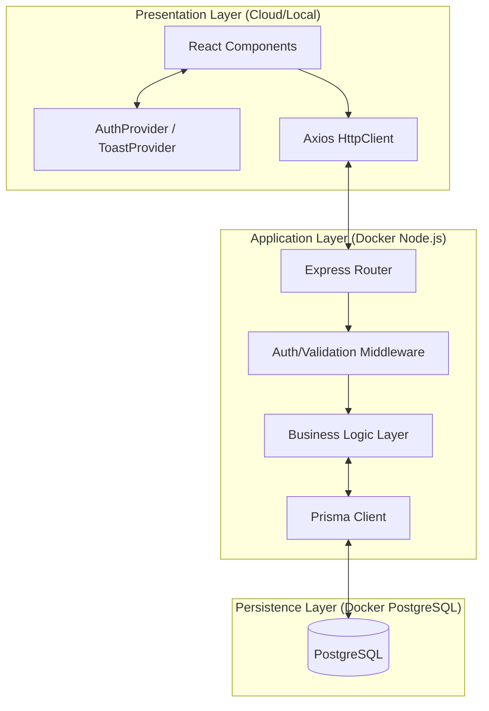
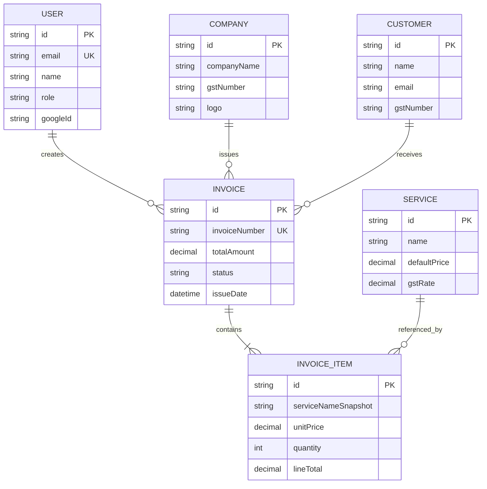

# Software Design Document - Professional Invoice Generator (PIG)

## 1. Introduction

### 1.1 Purpose
The Professional Invoice Generator (PIG) is designed to provide a comprehensive solution for freelancers and small businesses to manage their billing cycle. It focuses on speed, accuracy (especially in monetary calculations), and professional aesthetics.

### 1.2 Scope
This document covers the architectural, data, and interface design of the PIG system, including both the React-based frontend and the Express-based backend.

### 1.3 Design Goals
- **Real-time Editing**: Instant feedback during invoice creation.
- **Data Integrity**: Precise tax and total calculations.
- **Scalability**: Decoupled architecture for future extensions.
- **Ease of Use**: Streamlined workflows for managing customers and services.

---

## 2. System Architecture

The system utilizes a modern Three-Tier Architecture:

1.  **Presentation Tier**: React SPA (Vite) with Tailwind CSS.
2.  **Application Tier**: Node.js/Express.js REST API.
3.  **Data Tier**: PostgreSQL managed via Prisma ORM.

---

## 3. Data Design

### 3.1 Entity Relationship Diagram (ERD)

### 3.2 Data Dictionary (Core Models)

| Model | Description | Key Fields |
| :--- | :--- | :--- |
| **User** | System users (admins/staff). | `email`, `role`, `googleId` |
| **Invoice** | The primary billing document. | `invoiceNumber`, `totalAmount`, `status` |
| **Company** | Issuer profile (Logo, GST, Address). | `companyName`, `gstNumber`, `logo` |
| **Customer** | Recipient of the invoice. | `name`, `gstNumber`, `email` |
| **Service** | Product/Service catalog item. | `name`, `defaultPrice`, `gstRate` |
| **InvoiceItem** | Line items for a specific invoice. | `serviceNameSnapshot`, `lineTotal` |

---

## 4. Backend Design

### 4.1 Authentication Flow
- **Email/Password**: Standard bcrypt-hashed password storage.
- **Google OAuth**: Integration with Google's identity provider.
- **JWT**: Stateless session management with tokens passed via `Authorization` header.

### 4.2 Key Logic: Sequential Numbering
The backend implements an atomic transaction to fetch the last invoice number, increment it, and return it to the frontend. This prevents duplicate invoice numbers in a multi-user environment.

### 4.3 Data Snapshotting
To maintain historical accuracy, `InvoiceItem` stores a snapshot of the `serviceName` and `unitPrice` at the moment of creation. If a service's price changes later in the catalog, old invoices remain unchanged.

---

## 5. Frontend Design

### 5.1 Component Hierarchy
- **AppShell**: Navigation, Header, and Sidebar.
- **InvoiceEditor**: Complex form state handling calculations.
- **InvoicePreview**: High-fidelity rendering for PDF export.
- **Dashboard**: Visual summaries and status tracking.

### 5.2 State Management
- **Context API**: Used for `AuthContext` (User session) and `ToastContext` (Global notifications).
- **React Hooks**: Custom hooks for fetching data (`useInvoices`, `useCustomers`) to separate side effects from UI.

---

## 6. Business Logic Details

### 6.1 Monetary Precision
All monetary values are stored as `Decimal(20, 2)` or `Decimal(30, 2)` in PostgreSQL. The backend utilizes the Prisma-native decimal handler to ensure no floating-point errors occur during tax additions or total summations.

### 6.2 Export Logic
1.  **DOM Capture**: `html2canvas` captures the rendered `InvoicePreview` component.
2.  **PDF Generation**: `jspdf` wraps the image into a multi-page PDF document.

---

## 7. Security Design

- **Middleware**: `authMiddleware` verifies the JWT signature on every protected route.
- **Validation**: Server-side validation for all incoming POST/PUT requests using express-level checks.
- **CORS**: Restricted cross-origin resource sharing to trusted frontend domains.

---

## 8. Deployment and Infrastructure

### 8.1 Docker Composition
- **api**: Node.js environment running the Express server.
- **web**: Static file server or dev server for the React app.
- **db**: PostgreSQL 16 image with persistent volume mapping.

### 8.2 Environment Configuration
Managed through `.env` files ensuring secrets like `JWT_SECRET`, `DATABASE_URL`, and `GOOGLE_CLIENT_ID` are externalized.
